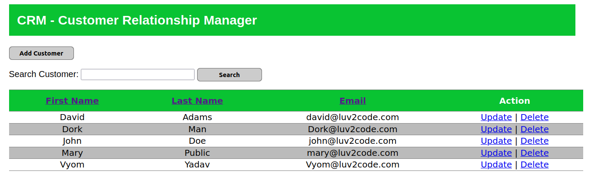
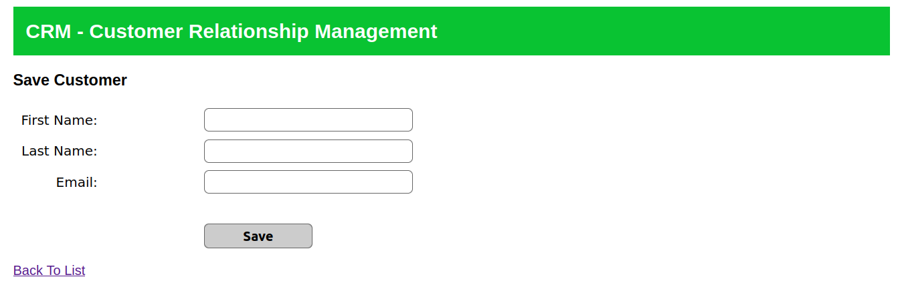

# Mini Customer Management System

## Part of a course on Spring, Hibernate by Chad Darby on Udemy

 

## Key Features
### CRUD
### Sorting
### Searching by name
### Logging Support
### User Authentication based on roles
